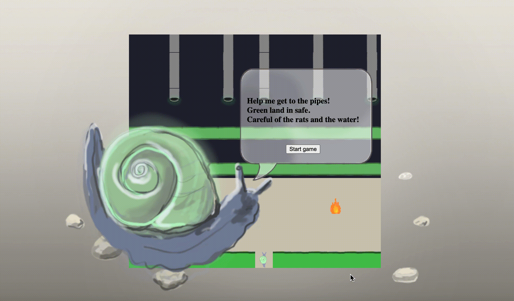
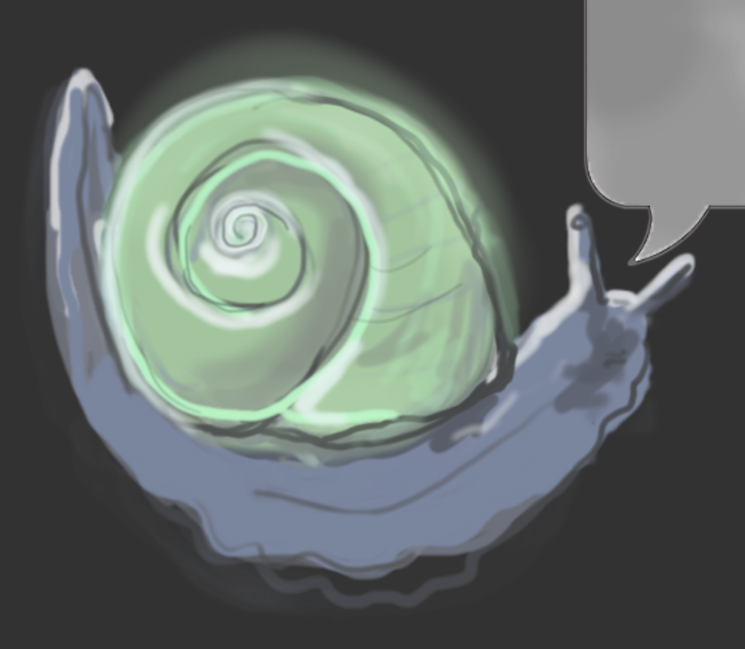

# Project One - Frogger

## Contents
[Overview](#overview)<br/>
[Deployed Project](#project)<br/>
[Technologies Used](#tech)<br/>
[Brief](#brief)<br/>
[Process](#process)<br/>
[Bugs](#bugs)<br/>
[Challenges](#challenges)<br/>
[Wins](#wins)<br/>
[Future Improvements](#future)<br/>
[Key Learning](#learning)<br/>


## <a name="overview"></a>Overview
This was my first project on General Assembly’s Software Engineering Immersive course. The goal was to build a functioning browser-based game with Vanilla JavaScript in **7 Days**. </br>
</br>



## <a name="project"></a>Link to Deployed Project
The game has been deployed with GitHub Pages and is available [here](https://annamonkman.github.io/sei-project-one/) <br/>
<br/>

**Directions:** Click on the start button, navigate the snail with the arrow keys on your keyboards, get to the pipes at the end to win but avoid the rats, holes and fire. Green is safe land & go on the boards to get across the oily river. 


## <a name="tech"></a>Technologies Used
* HTML5
*	CSS3
* JavaScript (ES6)
*	Git
*	GitHub
*	Procreate on iPad
* Adobe Photoshop
* VSCode

## <a name="brief"></a>Brief
The idea of Frogger is to guide a family of frogs across a road, and a river to their homes at the top of the screen.
To make things more challenging there are numerous moving obstacles that the frogs must avoid to reach their destination.
The game must be playable for one player and the obstacles should be auto generated. </br>
</br>
I wanted to give the game my own twist so chose to feature a snail instead of a frog, with the goal to help the snail get across a post-apocalyptic-esque wasteland with rats instead of cars and crisp packets and dried twigs for the boards. 

## <a name="process"></a>Process

### Day 1: Plan
Being new to JavaScript I wanted to keep my game simple and focus on meeting the brief requirements as well as I could. I started by wireframing the visuals and pseudo-coding the MVP. My MVP was to move one snail across the grid to the pipes at the top, with start game, restart game, win and lose functionality and collisions. I planned my time so that I would aim to reach the MVP after 5 days then have 2 days remaining for bugs and styling. 


### Day 2: Creating the Grid and Moving the Snail
I started by creating the grid that would house the game. In index.html I created a parent div with class name ‘grid’. In app.js I wrote a function createGrid(), using a for-loop to create divs (cells) and pushed these to an empty array, which was then appended to the parent div. 

```javascript
  const grid = document.querySelector('.grid')

  const width = 14
  const height = 13
  const cellCount = width * height
  const cells = []

   // * Make a grid
  function createGrid() {
    for (let i = 0; i < cellCount; i++) {
      const cell = document.createElement('div')
      // cell.textContent = i
      grid.appendChild(cell)
      cells.push(cell)
    }
    addSnail(snailStartPosition)
  }
```

I then added a snail class to the cell at the snail start position. When adding classes for each item I gave these a background colour in CSS so their positioning was clear to me visually. To allow the user to move the snail I added an event listener on the keyup event and handleKeyUp, addSnail and removeSnail functions. <br/>
</br>
The handleKeyUp function:
- has a condition so that when the start/restart game popups are displayed, the user cannot move the snail. 
- has an if statement to define the barriers of where the snail can be moved within.
-	removes the snail then adds it back into its new position. 
```javascript
function handleKeyUp(event) {
    const key = event.keyCode
    if (popupStart.style.display !== 'none' || popupLose.style.display !== 'none' || popupWin.style.display !== 'none' || cells[snailCurrentPosition].classList.contains(unsafeLandClass) === true && cells[snailCurrentPosition].classList.contains(boardClass) !== true) {
      return
    }
    removeSnail(snailCurrentPosition)
    if (key === 39 && snailCurrentPosition % width !== width - 1) { //cant go right
      snailCurrentPosition++
    } else if (key === 37 && snailCurrentPosition % width !== 0) { // cant go left
      snailCurrentPosition--
    } else if (key === 38 && snailCurrentPosition >= width) { // cant go up
      snailCurrentPosition -= width
    } else if (key === 40 && snailCurrentPosition + width <= height * width - 1) { // cant go down
      snailCurrentPosition += width
    } else {
      console.log('INVALID KEY')
    }
    addSnail(snailCurrentPosition)
    snailDie()
    snailWin()
  }
```

### Day 3 – 7: Safe and Unsafe land, Timers, Collisions, Win & Lose logic, Styling

### Adding Safe & Unsafe Land

Much of the game logic revolves around having ‘safe’ areas and ‘unsafe’ areas. If the snail collides with something unsafe it will die, ending the game, and if it collides with something safe, the user can continue. </br>
For the areas that took up a lot of space, I stored an array of the cell index numbers of where I wanted the areas to be placed in a const. ie. const unsafeLandArray = [0, 1, 2, 3, 4 etc.]. If I was to edit my code I would use a for-loop to be more economical with time and space. </br>
To add the classes to their respective cells, I created functions ie. addWaterClass(position) so, for each item add the water class to the cell. Then I called the functions towards the end of the code, passing the array as an argument. 

```javascript
const startStripArray = [168, 169, 170, 171, 172, 173, 174, 175, 176, 177, 178, 179, 180, 181]

 function addStartStripClass(positions) {
    positions.forEach(item => cells[item].classList.add(startStripClass))

    addStartStripClass(startStripArray)
  }
```

### Moving the Rats and Boards

Since there would be a lot of moving items, I wanted to get one working first, then apply this code to the others. </br>
I created a function moveRat() that adds the rat class (and unsafe land class for the lose collision) then runs a setInterval timer to update the let variable. The timer would, every 800 milliseconds, remove the rat class, then if the ratCurrentPosition was between certain cells, + or - 1 to the ratCurrentPosition to move it by one cell, and if the rat is not between certain cells, then + or – 13 (the number of cells in a row of the grid) to give it the appearance of a new rat coming into the game. Then I called the addRatClass() to add the rat into its new position.</br>
Since this method was eventually successful (although a little jumpy), I decided to apply it to the twigs & crisp packets as well. This did mean that my final code had a lot of repetition since I had a lot of items on timers. And it was quite time consuming to type out. 

```javascript
let ratTimerOne
const ratClass = 'rat'
let ratCurrentPosition1 = 167

function moveRatOne() {
    addUnsafeClass(ratCurrentPosition1)
    addRatClass(ratCurrentPosition1)
    ratTimerOne = setInterval(() => {
      removeUnsafeClass(ratCurrentPosition1)
      removeRatClass(ratCurrentPosition1)
      if (ratCurrentPosition1 <= 167 && ratCurrentPosition1 >= 154 + 1) {
        ratCurrentPosition1--
      } else {
        ratCurrentPosition1 += 13
      }
      addUnsafeClass(ratCurrentPosition1)
      addRatClass(ratCurrentPosition1)
    }, 800)
  }
```

### Die/Lose Logic
I needed to create a function for when the snail goes on unsafe land or collides with a rat. The function runs an if statement that checks if the cells with index of the snailCurrentPosition contains unsafeLandClass, & if so, sets a Timeout to call the removeSnail() function to show the snail has died. <br/>
Initially I didn’t clear the intervals of the moving items so when the player restarted the game, the timers became messed up and moved quicker. I realised I had to stop everything then restart them again. 

```javascript
function snailDie() {
    console.log('snail current pos >>', snailCurrentPosition)
    if (
      cells[snailCurrentPosition].classList.contains(unsafeLandClass) && 
      !cells[snailCurrentPosition].classList.contains(boardClass) &&
      !cells[snailCurrentPosition].classList.contains(pipeClass)) /*|| cells[ratCurrentPosition1].classList.contains(snailClass) === true)*/ {
      setTimeout(() => {
        popupLose.style.display = 'block'
        removeSnail(snailCurrentPosition)
        clearInterval(ratTimerOne) // etc. for all items on timers
      }, 1000)
    } else {
      console.log('SNAIL IS SAFE')
    }
  }
```

### Win Logic

I created a function that would run when the snail gets to the pipes at the top. 

```javascript
function snailWin() {
    console.log('snail current pos >>', snailCurrentPosition)
    if (cells[snailCurrentPosition].classList.contains(pipeClass) === true)  {
      setTimeout(() => {
        popupWin.style.display = 'block'
        removeSnail(snailCurrentPosition)
        clearInterval(ratTimerOne) //etc. for all items on timers
      }, 800)
    }
  }
```

### Start Game, Restart Game

In the HTML I created three divs for the start lose and win pop-ups with buttons on. In CSS I gave them an ‘absolute’ position and display of ‘none’. </br>
I added event listeners to the start and restart buttons that would call the startGame function. </br>
The startGame function:
- Changes popup display to 'none'.
- Calls all of the functions that move the animated items ie. moveCrispsFive, moveRatNine at the current position that is stored in a let variable.
- Adds the snail at the snailCurrentPosition.

```javascript
function startGame(event) {
    popupStart.style.display = 'none'
    popupWin.style.display = 'none'
    popupLose.style.display = 'none'
    moveRatOne(ratCurrentPosition1) //etc for all rats
    moveCrispsOne(boardCurrentPosition101) //etc for all crisps
    moveBoardFifteen(boardCurrentPosition15) //etc for all twigs
    snailCurrentPosition = 175
    addSnail(snailCurrentPosition)
  }

  startButton.addEventListener('click', startGame)

  restartButton.forEach((rbutton)=> {
    rbutton.addEventListener('click', startGame)
  })
```

### Styling
I looked at my archive of images for some inspiration and found some photos from an exhibition of screen prints by Urs Fischers on show 'soft' at Sadie Coles Gallery, London. I wanted a similar dreamlike, artificial quality and to use colours that show up strongly on screens. </br>
I drew the visuals in Procreate on an iPad at a very low resolutions since they’d be displayed very small-scale. </br>
All of the visuals are background images or colours that were applied to the cells. </br>
There are some  details I would adjust in the styling, such as aligning the pipes, changing the png of the snail when it moves in different directions, adding more custom styling to the popups. Working out how to make the fire GIF move. Also some more decoration in the main window such as pieces of trash. 



## <a name="bugs"></a>Bugs
- When the snail class is in the same cell as another class, only the background image of the snail class is shown. This makes it confusing for the player because it is not clear what land the snail is on.
- I originally had 3 twigs where the strip of green is in the water. However the 'board' class failed to add to these twigs meaning they are unsafe for the snail to go on. Because I noticed this bug very close to the end I had to improvise and just put a strip of safe land there instead. 


## <a name="challenges"></a>Challenges
- Along the way I definitely encountered many errors and rarely got things working correctly first time. For example an issue with a duplicate snail, the animations speeding up when the player restarted, among others. 
- I found the concept of a start game function quite difficult to begin with as I wasnt sure how much of the logic I had written would go inside it. In general figuring out what functions would do what and where they should be called. 
- Sticking with things I found more simple to understand (such as interval timers and if statements) and not exploring other more concise methods (partly due to time constraints).  

## <a name="wins"></a>Wins
- Although it could do with some tweaks I like the overall feel of the visuals, the bits I was most happy with being the crisp packets and glowing pipes that loom into the dark pool. 
- Patience and paying attention to detail. There was quite a bit of repetition when it came to the animated items. I tried to get one to work first before I did the rest, but occassionaly I would need to change something so I would have to go through each one individually (a reason to have mroe automated code). Also, if a number or name was slightly wrong it could create a big error, however I think picked up on these quickly.
- Commenting and organising my code.  
- Learning a lot about how to work with vanilla JavaScript.

## <a name="future"></a>Future Improvements
- Solve the bugs (twigs issue & snail replacing background)
- Simplifying bits of the code, for example less classes so the conditionals are less complicated.
- Find a way of animating the obstacles and boards in a more smooth manner.
- Fewer cells so I could populate it with less items and the items would appear larger. 
- Larger rats. 
- Get snail to move along with the crisp packets and twigs. 
- Snail changes direction when player moves it. (ie. turns to the right when player presses right arrow key).
- Rats face the way they are moving. 
- More complex improvements: levels of the game that increase in difficulty & a 'lives' counter that goes down if the snail dies. 


## <a name="learning"></a>Key Learning
- As this was my first project, I learned how to achieve each stage from wireframe to deployment and what working style is suited to this type of project. For example I learnt the importance of allowing lots of time to sort through bugs. 
- Getting used to solving bugs in different ways, such as looking through my code carefully for errors, using the different features on Visual Studio Code, searching online using sites like Stack Overflow. 